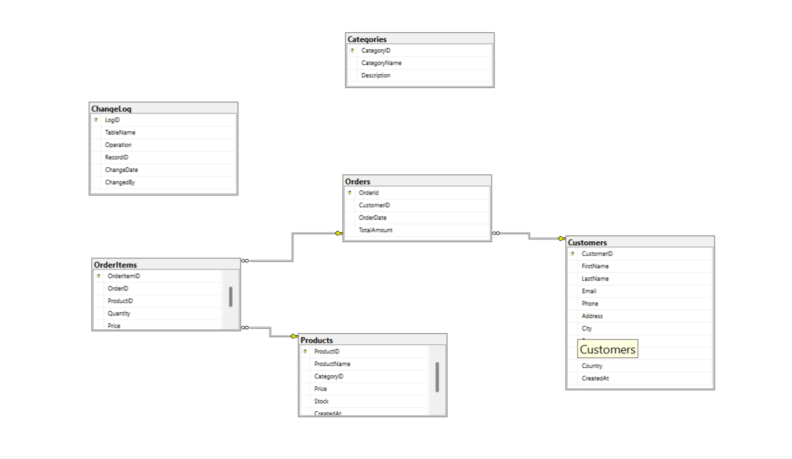

# 🗄️ SQL Database Management & Analytics Project

## 📌 Project Overview

This project demonstrates the design, development, and management of a **relational SQL database** for a real-world business scenario.

The project covers the complete database lifecycle, including **database design, schema creation, SQL querying, data analysis, triggers, indexing, views, database security, backups, and maintenance**.

The database is designed using multiple related entities such as **Customers, Vendors, Products, Orders, Delivery Agents, and Delivery Operations**, with relationships maintained using primary and foreign keys.

---

## 🗂️ Database Diagram




---

## 🛠️ Technologies & Tools

- **SQL Server**
- **T-SQL**
- **SQL Server Management Studio (SSMS)**
- Relational Database Management System (RDBMS)

---


### 1️⃣ Database Design & SQL

- Database design and schema creation
- Creating and managing tables
- Primary Keys and Foreign Keys
- Establishing relationships between tables
- Basic to advanced SQL queries
- Data aggregation and analysis
- Joins and subqueries
- Real-world business problem solving

### 2️⃣ Triggers & Change Logging

- Creating a **ChangeLog** table
- Creating triggers for automatic record logging
- Maintaining an audit trail of database changes
- Displaying custom messages during trigger execution
- Implementing automated record tracking

### 3️⃣ Indexing & Performance Optimization

- Introduction to database indexing
- Creating and managing indexes
- Understanding query performance
- Performance optimization techniques
- Practical indexing use cases

### 4️⃣ Views

- Creating and managing SQL Views
- Simplifying complex queries using Views
- Using Views for data access and reporting
- Practical real-world use cases

### 5️⃣ Database Security & DCL

- Creating SQL Server Logins
- Creating database Users
- Creating and managing Roles
- Assigning Users to Roles
- Granting permissions
- Revoking permissions
- Implementing role-based access control
- Working with **Data Control Language (DCL)**

### 6️⃣ Database Backup & Maintenance

- Creating database backups
- Restoring databases
- Creating automated maintenance plans
- Scheduling SQL Server Agent Jobs
- Database maintenance and recovery concepts

---

## 🔑 Key SQL Concepts Demonstrated

```text
Database Design
       ↓
Schema Creation
       ↓
Tables & Relationships
       ↓
SQL Queries
       ↓
Joins & Subqueries
       ↓
Data Analysis
       ↓
Triggers & Change Logging
       ↓
Indexes & Performance
       ↓
Views
       ↓
Security & Permissions
       ↓
Backup & Maintenance
```

---

## 📊 Database Features

| Feature | Description |
|---|---|
| Relational Database | Multiple related tables connected through keys |
| Primary Keys | Uniquely identify records |
| Foreign Keys | Maintain relationships between tables |
| SQL Queries | Retrieve and analyze business data |
| Joins | Combine information from multiple tables |
| Subqueries | Perform nested data analysis |
| Aggregations | Analyze data using functions such as `SUM`, `AVG`, `COUNT`, etc. |
| Triggers | Automatically record database changes |
| Indexes | Improve query performance |
| Views | Simplify complex queries and data access |
| Roles & Permissions | Control database access |
| Backup & Restore | Protect and recover database information |
| SQL Agent Jobs | Automate database maintenance |

---

## 🎯 Project Objectives

- Design a structured and scalable relational database.
- Maintain data integrity using primary and foreign keys.
- Perform complex SQL queries for business analysis.
- Use joins, subqueries, and aggregation functions to extract insights.
- Implement triggers for automated change logging.
- Improve query performance using indexes.
- Create Views for simplified data access.
- Implement database security using users, roles, and permissions.
- Perform database backup and restoration.
- Automate database maintenance using SQL Server Agent.


---

## 💡 Key Takeaways

Through this project, I gained practical experience in:

- Relational database design
- SQL and T-SQL programming
- Data analysis using SQL
- Database performance optimization
- Automated change tracking
- Database security and access control
- Backup and recovery
- Database maintenance automation

---


**Skills:** SQL | T-SQL | Database Management | Data Analysis | Power BI | Python | Machine Learning